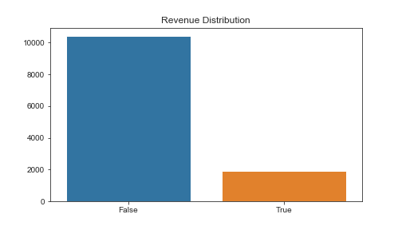

# Module 3 - Machine Learning Project - Revenue | No Revenue
*Data Part Time Barcelona Dec 2019*

*Hernan Sosa*

*Kristina Kunceviciute*

*Pau López*

*Isaac Rodriguez*

*Jose Casado*

## Table of Contents
- [Project Description/Goal](#project_description)
    * [Dataset information](#dataset_info)
    * [Columns and atribute information](#dataset_columns)
- [Dataset](#dataset)
- [Workflow](#workflow)
    * [EDA](#eda)
        * [Insights & Planning](#insights)
    * [Data Cleaning and Pipelines](#clean)
    * [Data transformation](#transform)
    * [Data Encoding](#encoding)
    * [Modelling](#model)
    * [Deep Learning](#deep)
- [Results](#results)
- [Future Work](#future_work)
- [References](#references)

## Project Description / Goal
What if that possible to predict revenue on an online shop? We want to know if a visit will buy or not.
We are going to create a Machine Learning Model to predict this question.

This dataset gathers information about costumers visiting an e-commerce webpage during a month. We'll be inspecting this data in order to be able to achieve our objective: being able to predict if a customer is likely to generate revenue given the dataset information.

### Dataset information:
The dataset consists of feature vectors belonging to 12,330 sessions, it contains 10 numerical and 8 categorical attributes.

The dataset was formed so that each session would belong to a different user in a 1-year period to avoid any tendency to a specific campaign, special day, user profile, or period.

### Columns and atribute information:
`Administrative`: Administrative Value

`Administrative_Duration`: Duration in Administrative Page

`Informational`: Informational Value

`Informational_Duration`: Duration in Informational Page

`ProductRelated`: Product Related Value

`ProductRelated_Duration`: Duration in Product Related Page

***

**The atributes seen above represent the number of different types of pages visited by the visitor in that session and total time spent in each of these page categories. The values of these features are derived from the URL information of the pages visited by the user and updated in real time when a user takes an action**

***

`BounceRates` Bounce Rates of a web page. The value of "Bounce Rate" feature for a web page refers to the percentage of visitors who enter the site from that page and then leave ("bounce") without triggering any other requests to the analytics server during that session.

`ExitRates` Exit rate of a web page. The "Exit Rate" feature for a specific web page is calculated as for all pageviews to the page, the percentage that were the last in the session.

`PageValues` Page values of each web page. The "Page Value" feature represents the average value for a web page that a user visited before completing an e-commerce transaction.

***

**The "Bounce Rate", "Exit Rate" and "Page Value" features represent the metrics measured by "Google Analytics" for each page in the e-commerce site.**

***

`SpecialDay` The "Special Day" feature indicates the closeness of the site visiting time to a specific special day (e.g. Mother’s Day, Valentine's Day) in which the sessions are more likely to be finalized with transaction. For example, for Valentine’s day, this value takes a nonzero value between February 2 and February 12, zero before and after this date unless it is close to another special day, and its maximum value of 1 on February 8.

`Month` Month of the year

`OperatingSystems` Operating system used

`Browser` Browser used

`Region` Region of the user

`TrafficType` Traffic Type

`VisitorType` Types of Visitor. Boolean. Returning or new visitor.

`Weekend` Weekend or not

`Revenue` Revenue will be generated or not. Can be used as the class label.

## Dataset
* Original dataset (not the one in this PROJECT)
https://www.kaggle.com/roshansharma/online-shoppers-intention#online_shoppers_intention.csv
The dataset of this project has been changed for educational purposes.

## Workflow
We have imported all the dataset in a pandas dataframe from the original .csv file.

### EDA 
First of all, after seeing the diferent variables, we have divided the EDA in numeric variables and categorical variables.

We see that some of our numerical columns have wrong dtypes. This may be due to errors in string-form in some of the values, that force pandas to transform all the column to object type. At this point, we transform this columns to numeric types, transforming all the non-numeric values to NaN in the process, to be taken care of.

Our target column will be 'Revenue', a column that indicates if the user has generated some revenue on the webpage. This column is a boolean type column, and has the following distribution:

We can see that our values are not balanced (equal values for True and False). In order to make proper predictions with our machine learning models, we have to balance this.

We did a quick visual exploration on each column to find potential issues on its values, and saw how they are distributed compared to our target column 'Revenue'.
We divided our columns in **categorical** and **continuous columns**, to be able to properly observe its characteristics.

**CATEGORICAL**

**CONTINUOUS**

Using boxplots in order to detect outliers.

After this EDA and explorating quite well our data, in order to analyze similarities between columns, we were looking for correlations. We were seeting up a function to be able to identify them in a clearer way.

In the heatmap, we saw mild correlations in the dataset overall. The most relevant ones are:

`Informational` and `Informational_Duration`: This is logical, the many pages you visited, the more time you spend on them. Not really relevant.

`ProductRelated` and `ProductRelated_Duration`: Same happens in this case, but with Product related webpages
`BounceRates` and `Exit_Rates`: This is also logical, since everytime a user quits the page without entering another section, is exiting the page at some point.

`PageValues` and `Revenue`: This is a biased correlation. The PageValues metric indicates the average value for a page that a user visited before landing on the goal page or completing an Ecommerce transaction. 
So, we'll have to remove this column since we have this metric AFTER a client has generated revenue.

#### Insights and Planning
This data does not come in a clean way, so after we inspect it we found that we have to fix some issues on the following columns:

* `Administrative` 
Contains some `999.0 values`. This is a lecture error, so we'll transform this values to `NaN`

* `Administrative_Duration` 
`object type` column. Since the data is `numerical`, we'll change it to `float`
Again, we'll move `-99 and -1.0` values to `NaN`

* `Informational`
Column type `float`. No processing needed.

* `Informational_Duration`
Column type `object`. We're changing object type to `float`
Change `-1.0 to nan`
Change `None to nan`

* `ProductRelated`
Column type `float`. No processing needed.

* `ProductRelated_Duration`
Column type `float`. Change `-1.0` values to `Nan`

* `Page Values`
Change `object` type to `float`
`#Nan` change to `NaN`

* `BounceRates`
Column type `float`. No processing needed.

* `ExitRates`
Column type `float`. No processing needed.

* `PageValues`
Column type `object`. No processing needed.

* `SpecialDay`
Column type `float`. No processing needed.

* `Month`
Column type `object`. Change `'MAY'` to `May` and `'March'` to `Mar`

* `OperatingSystems`
Column type `float`. Change `-999` and `?` to `NaN`

* `Browser`
Column type `float`. Change `-1` to `NaN` 

* `Region`
Column type `float`. Change `'Nan'` to `NaN`

* `TrafficType`
Column type `float`. No processing needed.

* `VisitorType`
Column type `object`. No processing needed.

* `Weekend`
Change `object` type to `bool` and `weekdays` to `0 and 1` 

* `Revenue`
Indicates if a client generated income or not. `Bool`. No processing needed

### Data Cleaning and Pipelines
* Following the instructions explained on the previous step, we proceed to clean the DataFrame. We will also save this Dataframe as an unprocessed but clean one.

* Some columns had wrong data types due to pandas import. Some columns had string character on numeric columns so they were converted to object.

* Due to the pipeline of our project, we won't fill the NA values since we'll be treating them with the sklearn methods in the next steps.

### Data Transformation
* Since we're performing some Machine Learning algorithms on our data, there are some transformations we need to do in order to be able to train our models. Also, our models need to be free of NaN, so we fill them with the method Foward Fill, that will preserve the distribution of our values in the Dataframe.

* We add a column from VisitorType transforming it's content into boolean: 1 is_returning, 0 is_new

* In Python, it's a good practice to typecast categorical features to a category dtype because they make the operations on such columns much faster than the object dtype.

* Let's apply a lambda function to classify our relevant values. After the visualization we can see that in Operating Systems we have categorical variables with few values and it's possible to reagrupate these values in a categorical variable called '999'
Applying a lambda function, we can see the '999' values. If we do a `.value_counts()` can certify that our values are the same values than before. So, we are maintaining the data but with a better classification.

* We apply this lambda function to:
    - Operating Systems
    - Browser
    - Traffic Type

* Data is now prepared for all the steps needed for predicting values with machine learning, so we also save a copy of this dataframe as `clean.csv` for further manipulation.

### Data Encoding

* We encode categorical variables to be able to use them in the models of machine learning.

* We will be using the **Label Encoder** for the columns `'Revenue'` and `'Weekend'`. These columns have only two categories meaning that we don't need to create different columns to encode the values.
Checking the value counts of these columns we can see that the values have been encoded to `0 (False)` and `1 (True)`.

* We will be using **OneHotEncoder** for `'Month'`, `'OperatingSystems'`, `'Region'`, `'TrafficType'` and `'Browser'` columns because they have more than two categories, therefore, additional columns have to be created.

### Modelling

* We will be testing our data with **6 classification models**:
    - **K-Nearest Neighbors**
    
    K-Nearest Neighbors is an algorithm by which an unclassified data point is classified based on its distance from known points.
    The way that model decides how to classify the unknown point is by creating a circle with the point as the center. 
    The size of the circle is set by choosing the number of neighbors. 
    
    We start our modeling with the K-Nearest Neighbors with the default number of neighbors (5).
    
    
    - **Logistic Regression**
    
    Logistic Regression is a Machine Learning classification algorithm that is used to predict the probability of a categorical dependent variable. 
    
    In logistic regression, the dependent variable is a binary variable that contains data coded as 1 (yes, success, etc.) or 0 (no, failure, etc.). In other words, the logistic regression model predicts P(Y=1) as a function of X.
    
    
    - **Decision Tree**
    
    Decision trees learn how to best split the dataset into smaller and smaller subsets to predict the target value. The condition, or test, is represented as the 'leaf' (node) and the possible outcomes as 'branches' (edges). This splitting process continues until no further gain can be made or a preset rule is met, e.g. the maximum depth of the tree is reached.
    
    
    - **Random Forest**
    
    Random forests construct many individual decision trees at training. Predictions from all trees are pooled to make the final prediction, the mode of the classes for classification or the mean prediction for regression. As they use a collection of results to make a final decision, they are referred to as Ensemble techniques.
    
    
    - **Linear Support Vector Classification**
    
    The objective of a Linear SVC (Support Vector Classifier) is to fit to the data provided, returning a 'best fit' hyperplane that divides or categorizes the data. After getting the hyperplane, you can then feed some features to the classifier to see what the 'predicted' class is. It has more flexibility in the choice of penalties and loss functions and should scale better to large numbers of samples compared to SVC.
    
    
    - **Gaussian Naive Bayes**
    
    A Gaussian Naive Bayes algorithm is a special type of NB algorithm. It assumes that all the features are following a gaussian distribution i.e, normal distribution and that the value of a particular feature is independent of the value of any other feature, given the class variable. An advantage of naive Bayes is that it only requires a small number of training data to estimate the parameters necessary for classification.
    
    
    
* We will focus our analysis to optimize the F1_score. When optimizing for F1_score we take both precision and recall into account. Trying to only optimize recall, the algorithm will predict most examples to belong to the positive class, but that will result in many false positives and, hence, low precision. 

* On the other hand, trying to optimize precision, the model will predict very few examples as positive results (the ones with the highest probability), but recall will be very low.

**We take take into account** :

* We have a binary classification problem

* Our target is unbalanced

### Deep Learning

## Results

Finally, after testing our data to these 6 classification models. We can verify that our better results are from:

**Linear Support Vector Classification** and **Random Forest** models

* **LINEAR SUPPORT VECTOR CLASSIFICATION**

F1 = 0.93

AUC = 0.98

* **RANDOM FOREST**

F1 =

AUC =

## Future Work
* **Clustering** 

Apply diferent type of clustering to our data.

* **Fine Tuning**

Investigate how to do a better tuning. Better Hyperparameter tuning of the models.

* **Different model procedures**

Run models and to se the scores without features. We have identified the most important but we have not deleted the less important features and see the different scores.

## References
* Relevant Papers:
Sakar, C.O., Polat, S.O., Katircioglu, M. et al. Neural Comput & Applic (2018).
